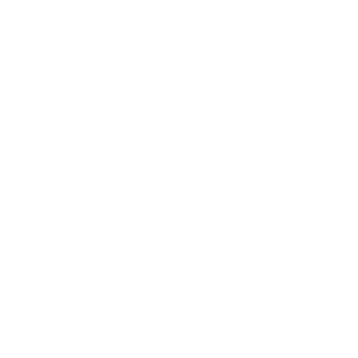

  

### I’m a passionate programmer, especially when it includes graphics and a splash of color :rainbow:

## ⚙️ Languages and Tools:

<table>
  <tr>
    <td valign="top" align="center" width="96px">
        
         C++
    </td>
    <td valign="top" align="center" width="96px">
        
         Vulkan
    </td>
    <td valign="top" align="center" width="96px">
        
         OpenGL
    </td>
    <td valign="top" align="center" width="96px">
        
         ArchLinux
    </td>
    <td valign="top" align="center" width="96px">
        
         Git
    </td>
    <td valign="top" align="center" width="96px">
        
         Nsight Graphics
    </td>
    <td valign="top" align="center" width="96px">
        
         Renderdoc
    </td>
    <td valign="top" align="center" width="96px">
        
         CMake
    </td>
  </tr>
</table>

## 💡 Stuff I also know:

<table>
  <tr>
    <td valign="top" align="center" width="96px">
        
         C
    </td>
    <td valign="top" align="center" width="96px">
        
         Python
    </td>
    <td valign="top" align="center" width="96px">
        
         Unreal Engine
    </td>
    <td valign="top" align="center" width="96px">
        
         LaTeX
    </td>
    <td valign="top" align="center" width="96px">
        
         Blender
    </td>
    <td valign="top" align="center" width="96px">
        
         Haskell
    </td>
    <td valign="top" align="center" width="96px">
        
         Java
    </td>
  </tr>
</table>

  
  

